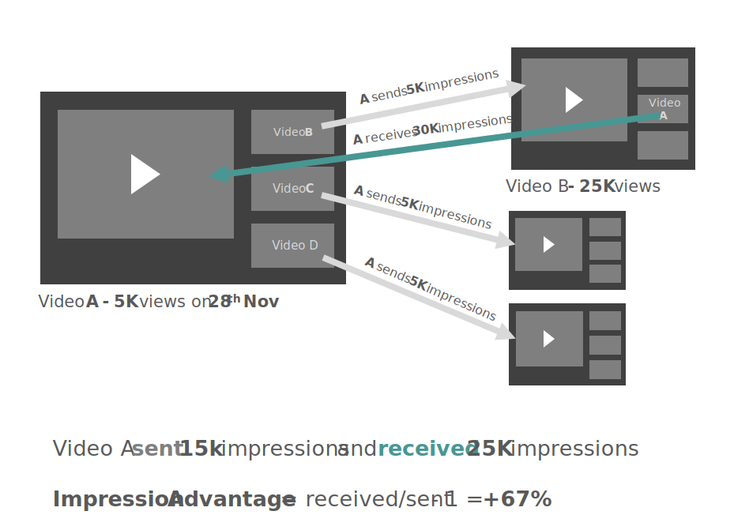
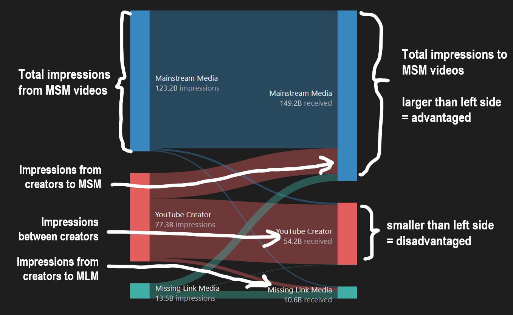
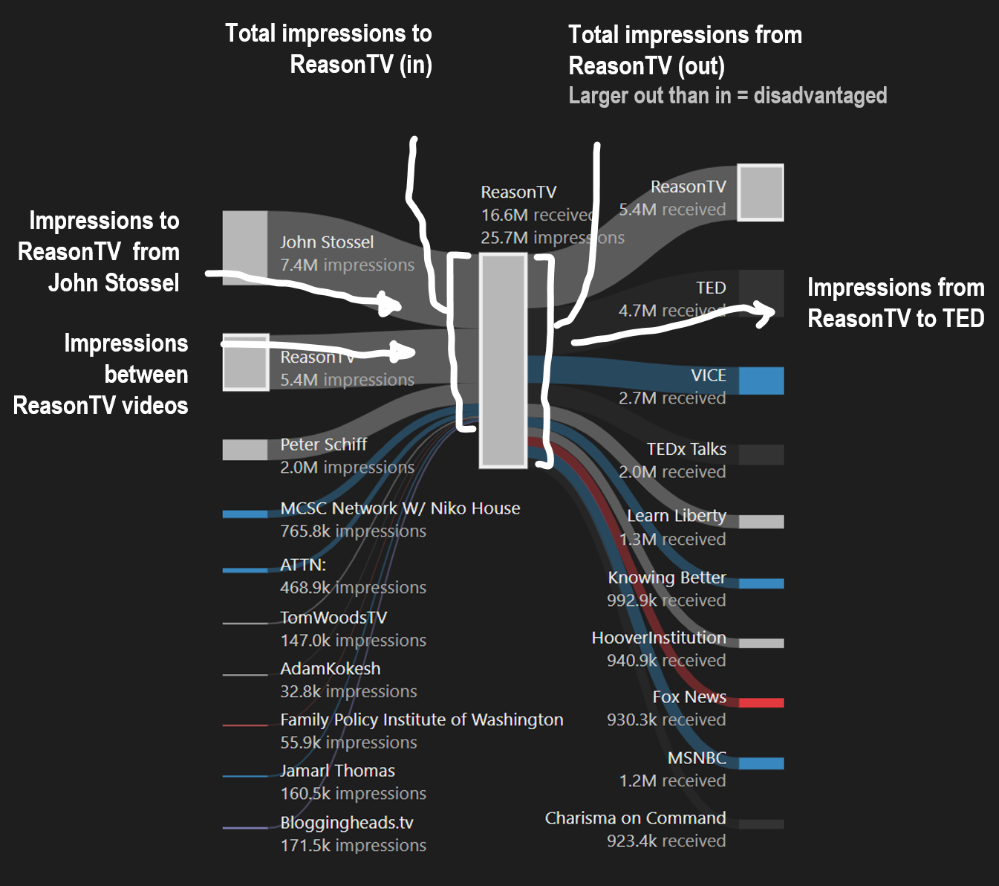

# Recfluence

[Recfluence](https://www.recfluence.net) is an analysis of YouTube's political influence through recommendations. This is important, because the algorithm that determines suggested videos has become an influential but underappreciated part of politics. A [Pew survey](https://www.journalism.org/2017/09/07/news-use-across-social-media-platforms-2017/) found that 18% of US adults consume news through YouTube, and — according to YouTube Chief Product Officer [Neal Mohan](https://www.cnet.com/news/youtube-ces-2018-neal-mohan/) — 70% of the watch time is from YouTube’s suggested videos.

## Data Collection Process 
A list of political channels is manually created, categorized and improved over time. An automated process run daily. It collects:
- **Channels** information & stats (e.g. subscribers, country) 
  - from the YouTube API.
- **Videos** information & stats (e.g. views, likes, title), captions
  - by scraping the website from a US IP address.
  - since 1st Jan 2018
  - updated daily stats for video's younger than 120 days
- **Recommendations** (i.e. from video A to video B)
  -  by scraping the website from a US IP address
  -  for video's younger than 120 days old (max 10)
  -  if no young video's, take the latest video's recommendations.

This is then analysed to provide statistics and data which is freely available for researches and media. 

### Channels Included
Channels were included if the met the following criteria
- 10k+ subscribers. If subscriber data is missing/lower, still include if video's average above 10k views
- Significant focus (more than 30% of content) on US political or cultural news/commentary. I considered cultural commentary was anything from the [ISideWith social issues list](https://www.isidewith.com/en-us/polls)

There is no definitive list of YouTube channels, so a variety of techniques were used. 
- Reviewed the following lists:
    - https://www.adfontesmedia.com/
    - https://blog.feedspot.com/political_youtube_channels/
    - https://socialblade.com/youtube/top/tag/politics/videoviews
    - https://channelcrawler.com/
    - custom algorithm prioritizing most recommended channels from existing seed channels. [ChannelExclude.csv](Data/ChannelExclude.csv) is was used to remove recommendations once reviewed.
    - Data & Society [Alternative Influence Report](https://datasociety.net/output/alternative-influence/)
    - Ribeiro et al. [Auditing Radicalization Pathways on YouTube](https://arxiv.org/pdf/1908.08313.pdf)
- Related videos/channels from existing channels
- Searches for keywords from [ISideWith social issues list](https://www.isidewith.com/en-us/polls)
- Suggestions from reviewers

This is not a repeatable process, but by using a variety of methods we are able to collect a much more comprehensive collection of relevant political channels than we could otherwise. By having the most complete list of channels possible, we are able to get a more accurate understanding of YouTube recommendation and we value this more than repeatability.

### Channel Classification
To understand the influence of recommendations we need to classify channels using fairly soft criteria to be relevant to way people discuss politics. To limit the subjectivity in this, a well defined process was followed to 'tag' channels appropriately based on the content of the videos. 3 or more reviewers have independently classified > 90% of the channels and the majority opinion used. The full [list of channels and each reviewers notes and classifications](https://docs.google.com/spreadsheets/d/17tO7k3cLF7wJXkfUgan5lQxLh047MPaMzD5ayB4G_rs/edit?usp=sharing) are available to review and use as you wish.

The following describes the process the revilers used to classify each channel:

### Left/Center/Right

For news:
- Compare https://www.adfontesmedia.com and https://mediabiasfactcheck.com/. If they exist in those lists and were in agreement then I accepted that category. Otherwise I used the same process as with the commentary channels.

For political/cultural commentary I considered all of the following:
 - Self identified political label, or support for a party
 - One sided content on divided political topics of the day (e.g. Kavanaugh, Migrant Caravan)
 - One sided content reacting to cultural events topics of the day (e.g. campus protests, trans activism )
 - Clearly matches Democrat (left) or Republican (right) views on issues in the [ISideWith poll](https://www.isidewith.com/en-us/polls)

 If these considerations align in the same direction then the channel is left or right. If there was a mix then they are assigned the center/heterodox category.

To calculated the *majority view*, Left/Center/Right are coded as -1, 0, and 1 respectively. The average is taken then rounded back to the nearest Left/Center/Right value.

### Hard Tags
Any combination of the following tags can be applied to a channel. Hard tags did not require any judgement and were classified by Mark. Soft tags were reviewed by each reviewer.

|Hard Tag|Examples|
|-|-|
|**Mainstream News**: Reporting on newly received or noteworthy information. Widely accepted and self-identified as news (even if mostly opinion). Appears in either https://www.adfontesmedia.com  or https://mediabiasfactcheck.com.|[Fox News](https://www.youtube.com/user/FoxNewsChannel), [Buzzfeed News](https://www.youtube.com/user/BuzzFeed)|
|**TV**: Content originally created for broadcast TV or cable|[CNN](https://www.youtube.com/results?search_query=CNN), [Vice](https://www.youtube.com/user/vice) |
|**AIN**: Listed in the [Alternative Influence Network](https://datasociety.net/output/alternative-influence/) report|[Sam Harris](https://www.youtube.com/user/samharrisorg), [Rubin Report](https://www.youtube.com/user/RubinReport)|
|Ribeiro's **AltLite,AltRight,IDW**: As listed in[ Auditing Radicalization Pathways on YouTube](https://arxiv.org/pdf/1908.08313.pdf)|

### Soft Tags
I used these heuristics to decide on the right soft tags to use
- **A natural Category for US YouTube content**. Many traditional ways of dividing politics are not a natural category for YouTube channels. In general, YouTubers are providing reaction and sense making to other channels or current events in the United States. In this way categories in align with their stand against positions are more natural.
- **Topical/Interesting**. The tag needs to be interesting in some way to the current meta-discussion about YouTube’s influence on politics. Intention with this is that topical cultural labels are hard to define. In this case I tried to find specific positions that could be mixed together to re-create these softer cultural categories.
- **Able to judged by the content itself**. It is important not to rely on outside judgements about the channels content. It's important to interpret the content with full context, but there should be no mind reading, or relying on judgement from other sources.
Enough Channels. It shouldn't be a minor niche, unless it is important for the radicalization pathway theory.

|Soft Tag|Examples|
|-|-|
|**Conspiracy**: Regularly promotes a variety of conspiracy theories. A conspiracy theory explains an evert/circumstance as the result of a secret plot that is not widely accepted to be true (even though sometimes it is). Example conspiracy theories: [Moon landings were faked](https://en.wikipedia.org/wiki/Moon_landing_conspiracy_theories), [QAnon](https://en.wikipedia.org/wiki/QAnon) & [Pizzagate](https://en.wikipedia.org/wiki/Pizzagate_conspiracy_theory), [Epstein was murdered](https://en.wikipedia.org/wiki/Death_of_Jeffrey_Epstein), [Trump-russia collusion](https://rationalwiki.org/wiki/Trump-Russia_connection).|[X22Report](https://www.youtube.com/user/X22Report), [The Next News Network](https://www.youtube.com/user/NextNewsNetwork)|
|**Libertarian**: A [political philosophy](https://en.wikipedia.org/wiki/Libertarianism) wth individual liberty as its main principal. Generally skeptical of authority and state power (e.g. regulation, taxes, government programs). Favor free markets and private ownership. To tag, this should be the main driver of their politics. Does not include libertarian socialists who also are anti-state but are anti-capitalist and promote communal living.|[Reason](https://www.youtube.com/user/ReasonTV), [John Stossel](https://www.youtube.com/user/ReasonTV), [The Cato Institute](https://www.youtube.com/user/catoinstitutevideo)|
|**Anti-SJW**: Significant focus on criticizing *Social Justice* (see below) with a positive view of the marketplace of ideas and discussing controversial topics. To tag, this should be a common focus in their content.|[MILO](https://www.youtube.com/user/yiannopoulosm), [Tim Pool](https://www.youtube.com/user/Timcasts)|
|**Social Justice**:   Beleive or promote: Identity Politics & Intersectionality (narratives of oppression though the combination of historically oppressed identities), *Political Correctness* (the restriction of ideas and words you can say in polite society), *Social Constructionism* (the idea that the differences between individuals and groups are explained entirely by environment. For example sex differences are caused by culture not by biological sex).  Content in reaction to Anti-SJW or conservative content.  Their supporters are active on [r/Breadtube](https://www.reddit.com/r/BreadTube/) and the creators often identify with this label. This tag only includes breadtuber’s if their content is criticizing ant-SJW’s (promoting socialism is its own, separate tag).| [Peter Coffin](https://www.youtube.com/user/petercoffin), [hbomberguy](https://www.youtube.com/user/hbomberguy)|
|**White Identitarian** Identifies-with/is-proud-of the superiority of “whites” and western Civilization.  An example of identifying with “western heritage”  would be to refer to the sistine chapel, or bach as “our culture”.  Promotes or defends: An ethno-state where residence or citizenship would be limited to “whites” OR a type of nationalist that seek to maintain a white national identity (white nationalism), historical narratives focused on the “white” lineage and its superiority, Essentialist concepts of racial differences  Are concerned about whites becoming a minority population in the US.|[NPI / RADIX](https://www.youtube.com/user/NPIAmerica), [Stefan Molyneux](https://www.youtube.com/user/stefbot)|
|**Educational**: Channel that has significant focuses on education material rleated to politics/culture.|[TED](https://www.youtube.com/user/TEDtalksDirector/videos), [SoulPancake](https://www.youtube.com/user/soulpancake)|
|**Late Night Talk show**: Channel with content presented humorous monologues about the day's news, guest interviews and comedy sketches.|[Last Week Tonight](https://www.youtube.com/user/LastWeekTonight), [Trevor Noah](https://www.youtube.com/channel/UCwWhs_6x42TyRM4Wstoq8HA)|
|**Partisan Left**: Mainly focused on politics and exclusively critical of Republicans. Would agree with this statement: “GOP policies are a threat to the well-being of the country“| [The Young Turks](https://www.youtube.com/user/TheYoungTurks), [CNN](https://www.youtube.com/user/CNN)|
|**Partisan Right**: Mainly focused on politics and exclusively critical of Democrats. Would agree with this statement: “Democratic policies threaten the nation”|[Fox News](https://www.youtube.com/user/FoxNewsChannel),[Candace Owens](https://www.youtube.com/channel/UCL0u5uz7KZ9q-pe-VC8TY-w)|
|**Anti-theist**: Self-identified atheist who are also actively critical of religion. Also called New Atheists or Street Epistemologists. Usually combined with an interest in philosophy.|[Sam Harris](https://www.youtube.com/user/samharrisorg), [CosmicSkeptic](https://www.youtube.com/user/alexjoconnor), [Matt Dillahunty](https://www.youtube.com/user/SansDeity)
|**Religious Conservative**: A channel with a focus on promoting Christianity or Judaism in the context of politics and culture.|[Ben Shapiro](https://www.youtube.com/channel/UCnQC_G5Xsjhp9fEJKuIcrSw), [PragerU](https://www.youtube.com/user/PragerUniversity)|
|**Socialist** Focus on the problems of capitalism. Endorse the view that capitalism is the source of most problems in society. Critiques of aspects of capitalism that are more specific (i.e. promotion of fee healthcare or a large welfare system or public housing) don’t qualify for this tag. Promotes alternatives to capitalism. Usually some form of either  Social Anarchist  (stateless egalitarian communities) or Marxist (nationalized production and a way of viewing society though class relations and social conflict).|[BadMouseProductions](https://www.youtube.com/user/xaxie1), [NonCompete](https://www.youtube.com/channel/UCkZFKKK-0YB0FvwoS8P7nHg/videos)|
|**Revolutionary**: Endorses the overthrow of the current political system. For example many Marxist and Ethno-nationalists are revolutionaries because they want to overthrow the current system and accept the consequences.|[Libertarian Socialist Rants](https://www.youtube.com/user/ElectricUnicycleCrew), [Jason Unruhe](https://www.youtube.com/user/MaoistRebelNews2)|
|**Provocateur**: Enjoys offending and receiving any kind of attention (positive or negative). Takes extreme positions, or frequently breaks cultural taboos. Often it is unclear if they are joking or serious.|[StevenCrowder](https://www.youtube.com/user/StevenCrowder), [MILO](https://www.youtube.com/user/yiannopoulosm)
|**MRA** (Men’s Rights Activist): Focus on advocating for rights for men. See men as the oppressed sex and will focus on examples where men are currently|[Karen Straughan](https://www.youtube.com/user/girlwriteswhat)|
|**Missing Link Media**: Channels funded by companies or venture capital, but not large enough to be considered “mainstream”. They are generally accepted as more credible than independent YouTube content.|[Vox](https://www.youtube.com/user/voxdotcom) [NowThis News](https://www.youtube.com/user/nowthismedia)|
|**State Funded**: Channels funded by a government.|[PBS NewsHour](https://www.youtube.com/user/PBSNewsHour), [Al Jazeera](https://www.youtube.com/user/AlJazeeraEnglish), [RT](https://www.youtube.com/user/RussiaToday)|
|**Anti-Whiteness**: A subset of Social Justice that in addition to intersectional beliefs about race, have a significant portion of content that essentialises race and disparages "whites" as a group. Negative generalizations about "whites" (e.g. "White folks are unemotional, they hardly even cry at funerals"). Use of the word "whiteness" as a slur, or an evil force (e.g. "I try to be less white"). Simplistic narratives about American history where the most important story is of slavery and racism. Dilute terms like racism, or white supremacy so that they include most Americans while keeping the stigma and power of the word. Content exclusively framing current events into racial oppression. Usually in the form of police violence against blacks, x-while-black (e.g. swimming while black).|[African Diaspora News Channel](https://www.youtube.com/channel/UCKZGcrxRAhdUi58Mdr565mw)|

To calculate the *majority view*, each soft tag is assessed independently. For each tag, the number of reviewer with that rag must tally to more than half.

Some tags/classifications reviewers agreed on most of the time (e.g. left/center/right, and conspiracy, anti-theist). Others there was only slightly better than random chance agreement (e.g. Educational, Provocateur). The graphic below shows a measure of how much reviewers agreed on channel classifications beyond change where 0 is purely random and 1 is always in agreement.

### Relevance
One limitation of the original analysis was that some late night shows -- with huge viewership -- weren't as political as most channels yet overwhelm the analysis. To fix this problem, each reviewer gave a relevance score representing the portion of content relevant to US politics & cultural commentary. In the analysis,  relevant views/recommendations are adjusted according to the average reviewer relevance score.

## Data
### Download

[Download](https://pyt-data.azureedge.net/data/results/v2.2/latest/recfluence_shared_data.zip) the latest data used for the diagrams. The full raw video and recommendations data can be provided on request - either as files or database access (at cost).

### Calculations and considerations
All source & calculations are available to review and use for your own purposes.

- [R Source](/Analysis/) Statistical calculations
- [SQL Source](https://github.com/markledwich2/YouTubeNetworks_Dataform/tree/master/definitions) Data transformation and basic calculations (using [dataform](https://dataform.co/))

|Calculation|Description|
|-|-|
|**impressions**|An estimate for the number of times a viewer was presented with a recommendation. I.e. we count each of the top 10 recommendations for a video as an "impression". Only YouTube knows true impressions, so we use the following process crete an estimate: Consider each combination of videos (e.g. *Video A* to *Video B*)  `(A to B impressions) = (recommendations from A to B) / (total recommendations from Video A) x (*A's views) x (recommendations per video=10)`  This can be aggregated to give impressions between channels, categories etc...|
|**relevant impressions**|`(A channel's relevance %) x impressions`|
|**channel views**|The total number of video views since *2018 Jan 1*|
|**daily channel views**|`(channel views) * (days in the period videos have been recorded for the channel)`|
|**relevant channel views**|`(daily channel views) * (channel relevance %)`|
|**impression advantage**|The ratio of impressions sent compared to received. |

**Ledwich & Zaitsev Group**
Derived from the list of channel tags and left/center/right classification.

|Condition based on tag or left/center/right (evaluated top to bottom)|Ledwich & Zaitsev Group|
|-|-|
|White Identitarian|White Identitarian|
|MRA|MRA|
|Conspiracy|Conspiracy|
|Libertarian|Libertarian|
|AntiSJW and (Provocateur or PartisanRight)|Provocative Anti-SJW|
|Anti-SJW|Anti-SJW|
|Socialist|Socialist|
|Religious Conservative|Religious Conservative|
|SocialJustice or Anti-Whiteness|Social Justice|
|(Left or Center) and (Mainstream News or Missing Link Media)|Center/Left MSM|
|Partisan Left|Partisan Left|
|Partisan Right|Partisan Right|
|Anti-Theist|Anti-Theist|
|(Everything Else)|Unclassified|

### Recfluence Visualization

**Channel Landscape**

This gives an overview of the "landscape" of channels, clustering like channels together using a [force directed graph](https://en.wikipedia.org/wiki/Force-directed_graph_drawing). 
Channels that have mutual recommendations are attracted un-connected channels repel. The orientation and placement on x/y don't have no specific meaning and will change each tim it is updated. 

**Understanding Impression Flow**

This shows the "flow" of impressions as a [sankey diagram](https://en.wikipedia.org/wiki/Sankey_diagram). When no selection have been made, it shows the impression flow between categories

When a channel/category is selected/highlighted it shows the flows through it

**Novel Interactivity**
- search for channel (top right)
- zoom and drag on the Channel Landscape 
- hover over a channel to see its details (details at top, impression flow below/right)
- choose different categories to color by
- highlight or select legend items

## Limitations

**Analysis Q & A / Notes**
- *Logged-off users are used to collect recommendations. Given the algorithm heavily weights user history, why would you expect this estimate of impressions would match real-world recommendations?*  Estimating impressions with logged-in users is difficult, you either need to simulate a representative set of user histories (laden with assumptions) or capture real users recommendations (difficult to get a large representative sample of users to install an extension). Fortunately creators can [export their channels actual incoming recommendations](https://www.youtube.com/watch?v=0sl1uYtqmWM), and if we can get a large enough same of those we can give an estimate of the accuracy. It is also reasonable to assume personalization will mostly "average out" when you total all users recommendations. A more detailed explanation defending this assumption can be found [here](https://medium.com/@anna.zaitsev/response-to-critique-on-our-paper-algorithmic-extremism-examining-youtubes-rabbit-hole-of-8b53611ce903). 
- Only recommendation's since 1st Nov 2019 is currently included in the analysis. We may provide an option to compare these historically in the future but the most relevant recommendation information is recent.
- *By only looking at political recommendation, channels who are recommended outside politics might seem like they are being disadvantaged?*  This indeed a limitation, you should consider the analysis of YouTube political influence only for those watching political/cultural channels and might not be representative of all types of videos.
- *Recommendations are not the only way viewers can be radicalized or influenced. Why are you so focused just on recommendations which might only have a small impact compared to the content itself and other psychological and social dynamics?*  That is very difficult to study. Our simplistic quantification of recommendation influence is something to ground that other research with, and reasonable to hold YouTube to account for.

**Process & Classification Q & A**
- *The classification of political category is prone to bias subjectivity, how can you trust the results?*   This is indeed a limitation, but one we have tried to address
    - Clear guidelines were given to 3+ reviewers who independently classified each channel
    - We measured the consistency between the reviewers judgments. Left/Center/Right classifications are moderately reliable, and tags are varius degrees of reliability. Take this into consideration
    - Respected sources of classification for left/right were used when possible (i.e. adfontesmedia.com and mediabiasfactcheck.com) which covered a large portion of the large mainstream channels.
    - The top 50 channels by video views make up the majority of all views. Download the channel data, then Go though the top 50 channels and check if you agree with the classification. If you generally accept the classifications then you can generally accept the results.

- *Why not perform a more procedural/quantifiable method for determining political category (e.g. like the process used for https://www.adfontesmedia.com)?*  I don't believe making this process more detailed and quantitative would give you a significantly more accurate/objective answer. We have performed some topic modelling, but the categories are less relevant to the public discussion about YouTube recommendations.
- *Why is the apposition to Identity Politics/Social Justice considered "right" when it is not normally considered an important part of the standard political definition for left/right?*   I understand this, but I am confident this has changed. It is clear when evaluating YouTube content that this is a new and important divide. 
- *The left/right dichotomy is not a good way to classify tribal politics, why do it that way?*     I agree, and forcing it into this model creates many needless problems because it is not a natural category for this data. We have now provided a way to view channels by ideology.

## Updates
**25 Nov 2019**: Now hosted at [recfluence.net](https://www.recfluence.net). Large new analysis and classification of channels.

**14 Jan 2019**: New channels and some updates. The network diagram looks quite different at first, but that's mostly cosmetic. The rotation and location of them are somewhat different but it clusters similarly. To see the older version matching the published article use [this link](https://pyt.azureedge.net?v=2018-12-28)

 
